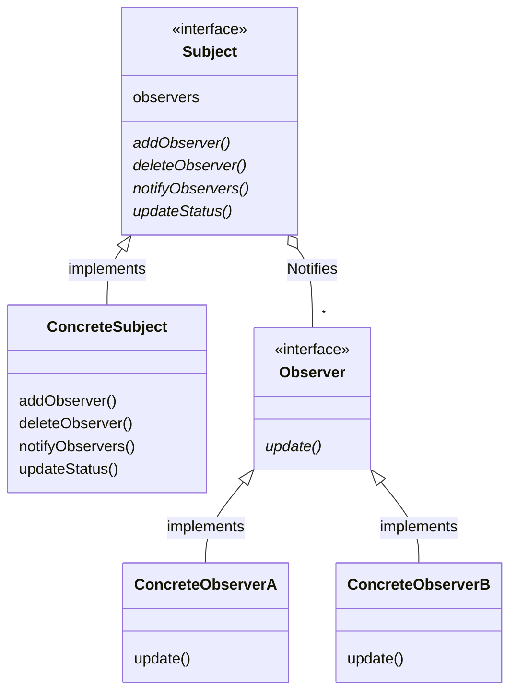
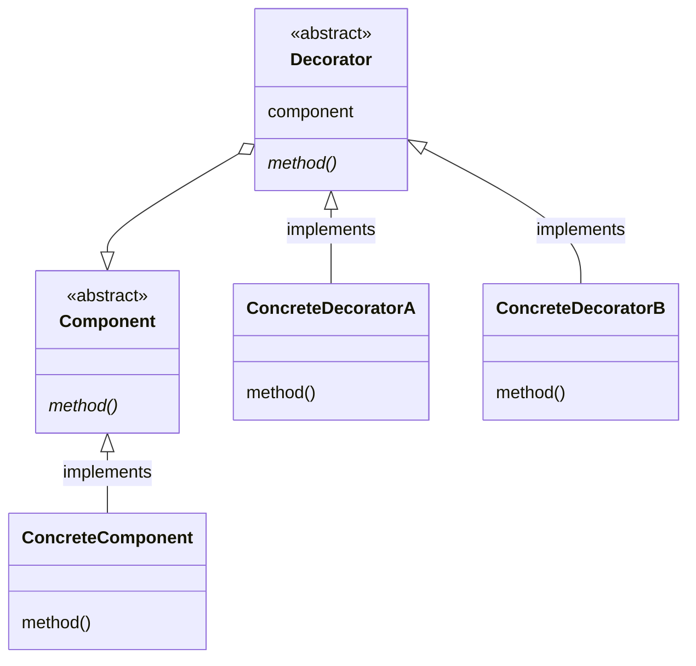
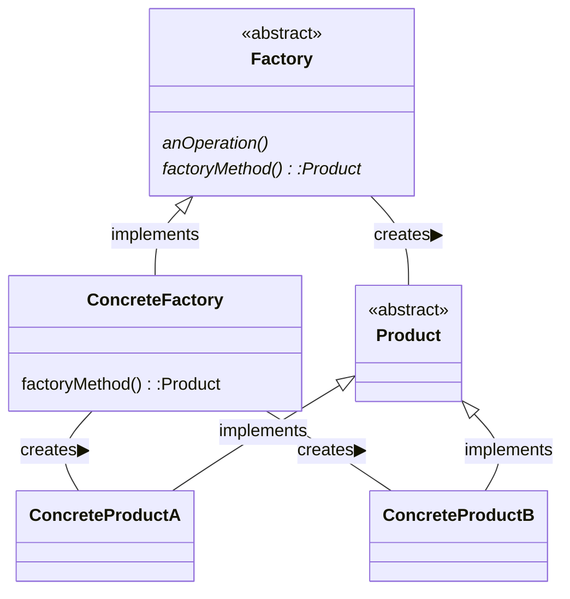
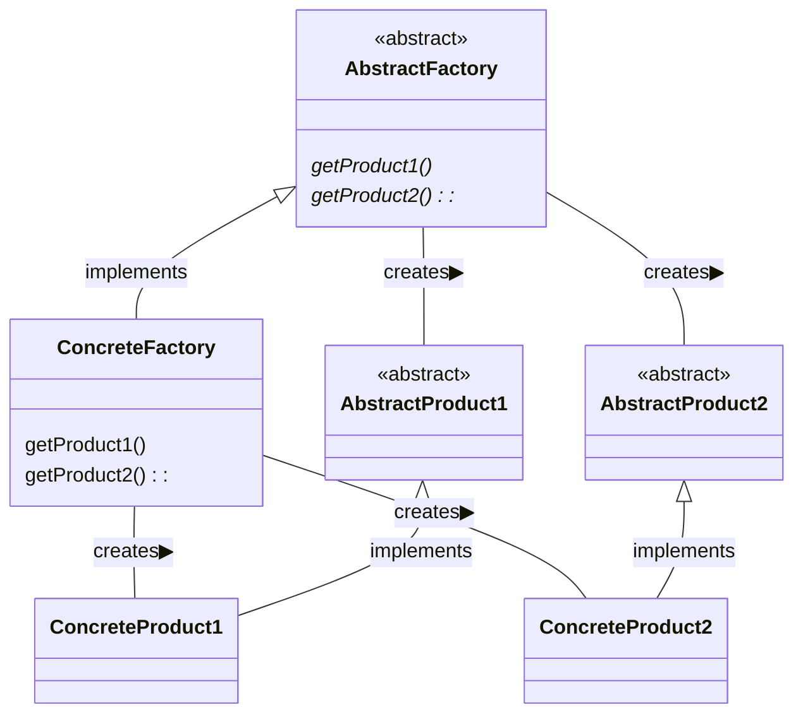
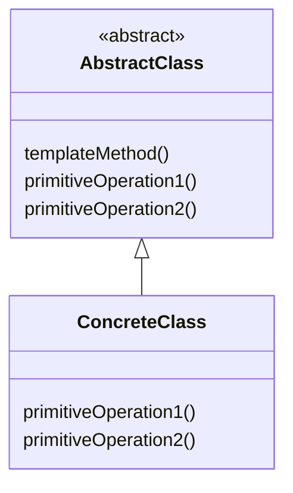
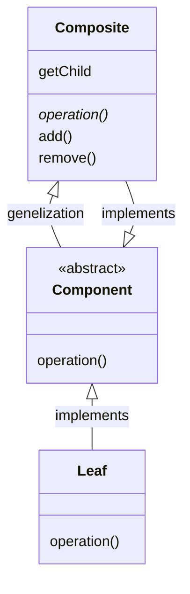

# 課題２：デザインパターンのまとめ


## *Observerパターン*
### 概要
* ObserverクラスにSubjectクラスの変更の通知するパターン。

* 概略図



### 事例１
* サンプルケース  
数字を変更したときに  
・数字を表示する画面  
・数字をグラフとして表示する画面  
の二つの画面を同時に変更する場合。

* サンプルコード  
・python  
```python
def main():
    m = ConcreteModel()
    m.add_observer(NumView())
    m.add_observer(ExcelView())
    for i in [5, 10, 15]:
        m.num = i


# Subject
class Model:
    def __init__(self):
        self.__observers = []
        self.__num = None

    def add_observer(self, observer):
        self.__observers.append(observer)

    def notify_observer(self):
        for observer in self.__observers:
            observer.update(self)


# ConcreteSubject
class ConcreteModel(Model):
    def __init__(self):
        super().__init__()

    @property
    def num(self):
        return self.__num

    @num.setter
    def num(self, num):
        self.__num = num
        self.notify_observer()  # important point


class Observer:
    def __init__(self):
        pass

    def update():
        pass


# ConcreteObserver1
class NumView(Observer):
    def __init__(self):
        pass


    def update(self, model):
        s = "NView: {}".format(model.num)
        print(s)


# ConcreteObserver2
class ExcelView(Observer):
    def __init__(self):
        pass

    def update(self, model):
        s = "EView: {}".format("*" * model.num)
        print(s)


if __name__ == "__main__":
    main()
```
・出力
```python
NView: 5
EView: *****
NView: 10
EView: **********
NView: 15
EView: ***************
```

### 事例２
* サンプルケース

* サンプルコード

### その他（注意事項など，なんでも）


<br><br><br>
## *Decoratorパターン*
### 概要
* 説明
* オブジェクトを装飾するためのクラスを作る。
* 既存のオブジェクトに動的に処理を追加することができる。

* 概略図



### 事例１
* サンプルケース  
平均値を計算するmean関数に対して,与えられた引数が文字列の型であっても計算できるようにDecorateする.

* サンプルコード  
・python
```python
import functools


def main():
    print(mean("0.1", 0.2, "0.3"))


# Decorateする関数
def float_args_and_return(function):
    @functools.wraps(function)
    def wrapper(*args, **kargs):
        args = [float(arg) for arg in args]
        return function(*args, **kargs)
    return wrapper


# Decorateされる関数
@float_args_and_return
def mean(first, second, *rest):
    numbers = (first, second) + rest
    return sum(numbers) / len(numbers)


if __name__ == "__main__":
    main()

```

* 出力
```python
0.20000000000000004
```

### 事例２
* サンプルケース

* サンプルコード

### その他（注意事項など，なんでも）


<br><br><br>
## *Factory Methodパターン*
### 概要
* インスタンスの生成を行う専用のクラスを使う
* 複数のバリエーションを持つオブジェクトの生成をカプセル化する

* 概略図



### 事例１
* サンプルケース

メモ帳のページのように、特定の文字列を保持するオブジェクトを大量に作成する場合。

* サンプルコード

以下はこのサンプルケースを実装するPythonプログラムの例である。
```python
from abc import ABCMeta, abstractmethod

# abstract
class Product(metaclass=ABCMeta):
    @abstractmethod
    def use(self):
        pass

# abstract
class Factory(metaclass=ABCMeta):
    # anOperation
    def create(self, data):
        ret = self.factoryMethod(data)
        return ret

    @abstractmethod
    def factoryMethod(self, data):
        pass

# ConcreteFactory
class NotepadProduct1(Product):
    def __init__(self, data):
        self.data = data
        print(f"Recorded: {self.data}")

    def use(self):
        print(f"Note1 says: {self.data}")

class NotepadProduct2(Product):
    def __init__(self, data):
        self.data = data
        print(f"Recorded: {self.data}")

    def use(self):
        print(f"Note2 says: {self.data}")

# ConcreteProduct
class NotepadFactory1(Factory):
    def factoryMethod(self, data):
        return NotepadProduct1(data)

class NotepadFactory2(Factory):
    def factoryMethod(self, data):
        return NotepadProduct2(data)


if __name__ == "__main__":
    factory1 = NotepadFactory1()
    factory2 = NotepadFactory2()
    note1 = factory1.create("hoge")
    note2 = factory1.create("fuga")
    note3 = factory2.create("piyo")
    note1.use()
    note2.use()
    note3.use()
```

出力結果は次の通りである。
```sh
$ python3 factory_method_sample_1.py
Recorded: hoge
Recorded: fuga
Recorded: piyo
Note1 says: hoge
Note1 says: fuga
Note2 says: piyo
```
### 事例２
* サンプルケース

* サンプルコード

### その他（注意事項など，なんでも）


<br><br><br>
## *Abstract Factoryパターン*
### 概要
* 関連のある一連のオブジェクト群をまとめて生成する方法を提供する．
具体的な実装はサブクラスで行う．

* 概略図



### 事例１
* サンプルケース

* サンプルコード

### 事例２
* サンプルケース

* サンプルコード

### その他（注意事項など，なんでも）
* Factory Methodは1つのインスタンスを生成するためのものであるが，Abstract Factoryは複数の部品を組み合わせて1つのインスタンスを生成するときに使う．また，Factory Methodはメソッドで表現し，Abstract Factoryはクラスで表現する．
<br><br><br>
## *Singletonパターン*
### 概要
* そのクラスのインスタンスが1つしか生成されないことを保証する．

* 概略図

### 事例１
* サンプルケース

リソースの削減や多重アクセス防止のために、ただ1つのインスタンスとしてファイルマネージャを作成したい場合。

* サンプルコード

ファイルマネージャがシングルトンを継承することでサンプルケースを実装した。以下は、c++で実装したサンプルコードである。
```cpp
template<class T>
class Singleton
{
public:
    static inline T& GetInstance()
    {
        static T instance;
        return instance;
    }

protected:
    Singleton() {}
    virtual ~Singleton() {}

private:
    void operator=(const Singleton& obj) {}
    Singleton(const Singleton &obj) {}
};

class FileManager : public Singleton<FileManager>
{
public:
    friend class Singleton<FileManager>;

public:
    bool FileExists(const char* strName) const;
    File* OpenFile(const char* strName, eFileOpenMode mode);
    bool CloseFile(File* pFile);

protected:
    FileManager();
    virtual ~FileManager();
};

```


### 事例２
* サンプルケース

* サンプルコード

### その他（注意事項など，なんでも）
* インスタンスの状態を保持したり，クラス間で共通のメソッド，プロパティにアクセスしたい場合に用いる事が多い．
* 単純にコンストラクタとデストラクタをprivateにして、getInstanceでインスタンスを返すだけの場合、スレッドセーフでないという問題がある。
<br><br><br>
## *Adapterパターン
### 概要
* 既存のインターフェースを、クライアントが望むインターフェースと互換性を持たせるために変換するパターン。継承を用いる場合と委譲を用いる場合の2種類がある。

* 概略図

### 事例１
* サンプルケース
print

* サンプルコード

### 事例２
* サンプルケース

* サンプルコード

### その他（注意事項など，なんでも）


<br><br><br>
## *Facadeパターン*
### 概要
* 複雑な内部処理を隠蔽し，利用者にシンプルなインターフェースを提供する．

* 概略図

### 事例１
* サンプルケース

* サンプルコード

### 事例２
* サンプルケース

* サンプルコード

### その他（注意事項など，なんでも）


<br><br><br>
## *Template Methodパターン*
### 概要
* スーパークラスで処理手順の枠組みを決める．その手順で利用するメソッドを抽象メソッドで定義し，サブクラスで具体的な処理を実装する．

* 概略図


### 事例１
* サンプルケース

* サンプルコード

### 事例２
* サンプルケース

* サンプルコード

### その他（注意事項など，なんでも）


<br><br><br>
## *Iteratorパターン*
### 概要
* 内部実装を公開せずに，コンテナオブジェクトの要素１つ１つに，順次アクセスする方法を提供する

* 概略図

### 事例１
* サンプルケース

* サンプルコード

### 事例２
* サンプルケース

* サンプルコード

### その他（注意事項など，なんでも）


<br><br><br>
## *Compositeパターン*
### 概要
* オブジェクトの関係性に関するパターンである。ファイルシステムのような木構造を持つ再帰的なデータ構造に関して、全体像と個別のオブジェクトに同一の操作を可能にする。

* 概略図

### 事例１
* サンプルケース

ファイルシステムにおいて、あるフォルダを削除するとそれ以下の内容物がまとめて削除される場合に、内容物の一つ一つがファイルとフォルダのどちらであるのかを意識せずに削除できるようにしたいケース。

* サンプルコード

### 事例２
* サンプルケース

* サンプルコード

### その他（注意事項など，なんでも）
