# 課題２：デザインパターンのまとめ


## *Observerパターン*
### 概要
* ObserverクラスにSubjectクラスの変更の通知するパターン。

* 概略図

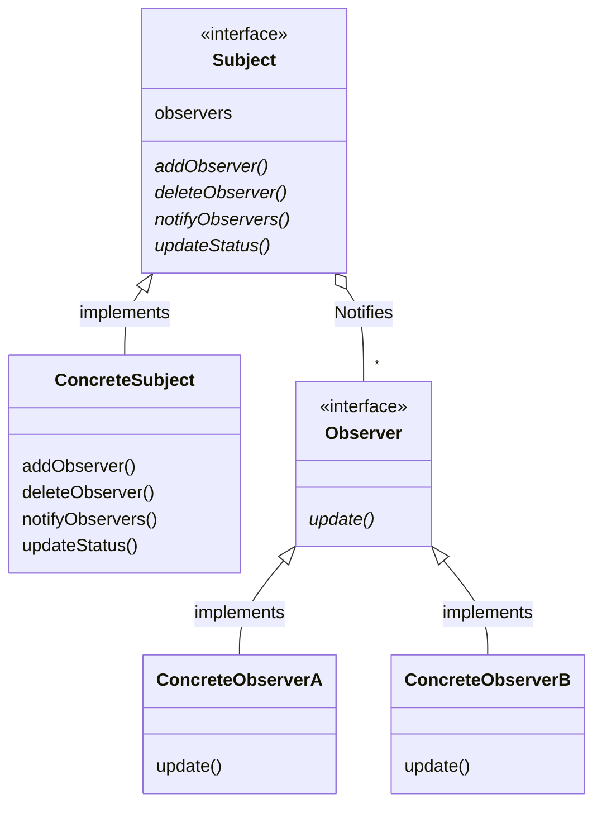

### 事例１
* サンプルケース  
数字を変更したときに  
・数字を表示する画面  
・数字をグラフとして表示する画面  
の二つの画面を同時に変更する場合。

* サンプルコード  
・python  
```python
def main():
    m = ConcreteModel()
    m.add_observer(NumView())
    m.add_observer(ExcelView())
    for i in [5, 10, 15]:
        m.num = i


# Subject
class Model:
    def __init__(self):
        self.__observers = []
        self.__num = None

    def add_observer(self, observer):
        self.__observers.append(observer)

    def notify_observer(self):
        for observer in self.__observers:
            observer.update(self)


# ConcreteSubject
class ConcreteModel(Model):
    def __init__(self):
        super().__init__()

    @property
    def num(self):
        return self.__num

    @num.setter
    def num(self, num):
        self.__num = num
        self.notify_observer()  # important point


class Observer:
    def __init__(self):
        pass

    def update():
        pass


# ConcreteObserver1
class NumView(Observer):
    def __init__(self):
        pass


    def update(self, model):
        s = "NView: {}".format(model.num)
        print(s)


# ConcreteObserver2
class ExcelView(Observer):
    def __init__(self):
        pass

    def update(self, model):
        s = "EView: {}".format("*" * model.num)
        print(s)


if __name__ == "__main__":
    main()
```
・出力
```python
NView: 5
EView: *****
NView: 10
EView: **********
NView: 15
EView: ***************
```

### 事例２
* サンプルケース

* サンプルコード

### その他（注意事項など，なんでも）


<br><br><br>
## *Decoratorパターン*
### 概要
* 説明
* オブジェクトを装飾するためのクラスを作る。
* 既存のオブジェクトに動的に処理を追加することができる。

* 概略図

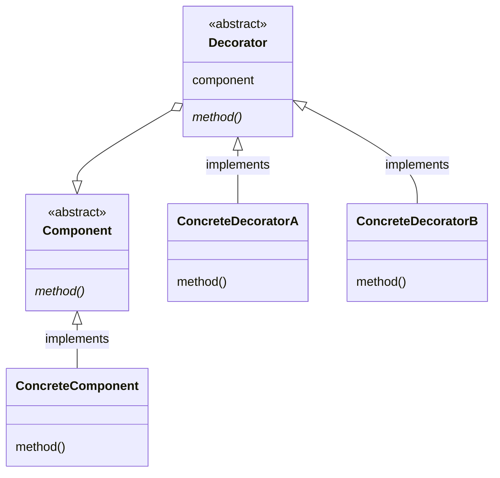

### 事例１
* サンプルケース  
平均値を計算するmean関数に対して,与えられた引数が文字列の型であっても計算できるようにDecorateする。

* サンプルコード  
・python
```python
import functools


def main():
    print(mean("0.1", 0.2, "0.3"))


# Decorateする関数
def float_args_and_return(function):
    @functools.wraps(function)
    def wrapper(*args, **kargs):
        args = [float(arg) for arg in args]
        return function(*args, **kargs)
    return wrapper


# Decorateされる関数
@float_args_and_return
def mean(first, second, *rest):
    numbers = (first, second) + rest
    return sum(numbers) / len(numbers)


if __name__ == "__main__":
    main()

```

* 出力
```python
0.20000000000000004
```

### 事例２
* サンプルケース

* サンプルコード

### その他（注意事項など，なんでも）


<br><br><br>
## *Factory Methodパターン*
### 概要
* インスタンスの生成を行う専用のクラスを使う
* 複数のバリエーションを持つオブジェクトの生成をカプセル化する

* 概略図

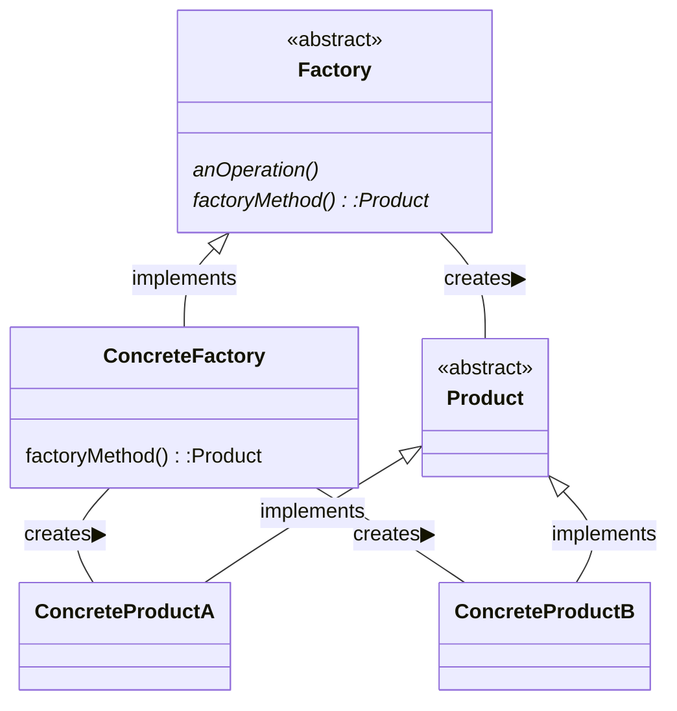

### 事例１
* サンプルケース

メモ帳のページのように、特定の文字列を保持するオブジェクトを大量に作成する場合。

* サンプルコード

以下はこのサンプルケースを実装するPythonプログラムの例である。
```python
from abc import ABCMeta, abstractmethod

# abstract
class Product(metaclass=ABCMeta):
    @abstractmethod
    def use(self):
        pass

# abstract
class Factory(metaclass=ABCMeta):
    # anOperation
    def create(self, data):
        ret = self.factoryMethod(data)
        return ret

    @abstractmethod
    def factoryMethod(self, data):
        pass

# ConcreteFactory
class NotepadProduct1(Product):
    def __init__(self, data):
        self.data = data
        print(f"Recorded: {self.data}")

    def use(self):
        print(f"Note1 says: {self.data}")

class NotepadProduct2(Product):
    def __init__(self, data):
        self.data = data
        print(f"Recorded: {self.data}")

    def use(self):
        print(f"Note2 says: {self.data}")

# ConcreteProduct
class NotepadFactory1(Factory):
    def factoryMethod(self, data):
        return NotepadProduct1(data)

class NotepadFactory2(Factory):
    def factoryMethod(self, data):
        return NotepadProduct2(data)


if __name__ == "__main__":
    factory1 = NotepadFactory1()
    factory2 = NotepadFactory2()
    note1 = factory1.create("hoge")
    note2 = factory1.create("fuga")
    note3 = factory2.create("piyo")
    note1.use()
    note2.use()
    note3.use()
```

出力結果は次の通りである。
```sh
$ python3 factory_method_sample_1.py
Recorded: hoge
Recorded: fuga
Recorded: piyo
Note1 says: hoge
Note1 says: fuga
Note2 says: piyo
```
### 事例２
* サンプルケース

* サンプルコード

### その他（注意事項など，なんでも）


<br><br><br>
## *Abstract Factoryパターン*
### 概要
* 関連のある一連のオブジェクト群をまとめて生成する方法を提供する．
具体的な実装はサブクラスで行う．
- AbstructFactoryパターンは以下の場合に有効である。
    - システムの部品の生成、組み合わせ、表現の方法から独立にすべき場合
    - 部品の集合が複数存在して、その中の１つを選んでシステムを構築する場合。
    - 部品のクラスライブラリを提供する際に、インターフェースだけを公開して実装は非公開にしたい場合。
- メリット
    - *具象クラスを局所化する。*
        互いに関連したり依存し合うオブジェクト群を、そのクラスを明確にせずに生成するためのインターフェースを提供することにより、生成するオブジェクトのクラスをプログラマが制御できるようにする。またオブジェクトの具象クラスはFactory具象クラスの中に隠蔽されており、Clientクラスは各オブジェクトを抽象インターフェースを通して操作できる。
    - *部品の集合を容易に変更できる。*
        Factory具象クラスは必要なすべての部品オブジェクトを生成するため、Factory具象クラスを別の具象クラスに変えることで部品の構成を一度に変更できる。
- デメリット
    - *新しい種類の部品を追加するのが難しい。*
        AbstructFactoryパターンでは生成される部品の集合を固定しているため、新しい種類の部品の追加にはインターフェースの変更が必要で容易ではない。

* 概略図

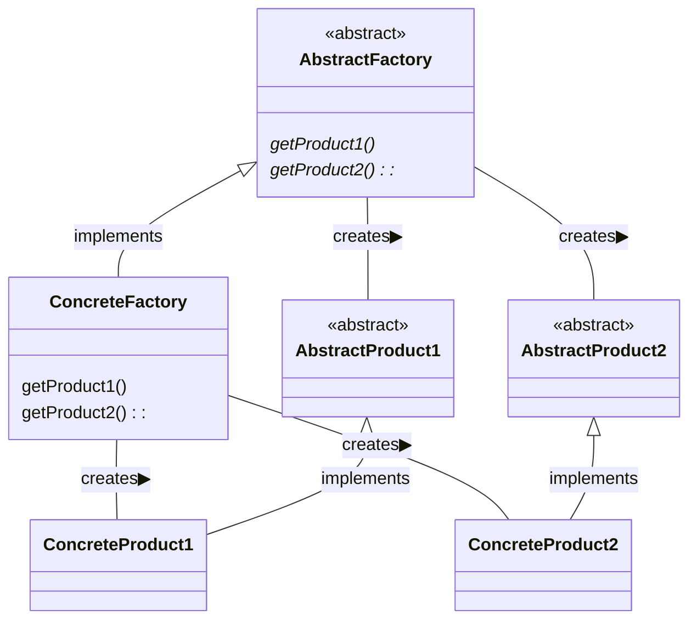

### 事例１
* サンプルケース
- いくつかの部品を組み合わせて車を生成する処理にAbstruct Factoryパターンを適用してみる。
AbstructCarFactoryクラスは車の構成要素を生成するもので、タイヤ, ドア, ハンドルをそれぞれ生成する。
ClientクラスはAbstructCarFactoryクラスを使用することで、具象クラスを知らずに車の構成部品を生成できる。
車の部品を別の部品に変更したい(例えばタイヤをTire1からTire2クラスへ変更したい)場合はクライアントの使うCarFactoryクラスを別のCarFactoryクラスに変更すればよく、コードの変更を最小限に抑えられる。
* サンプルコード
- クラス図は以下のようになった。このクラス図はplantUMLを使用して作成している。

```
@startuml
class AbstructCarFactory
class Car
class AbstructTire
class AbstructHandle
class AbstructDoor
class Client
class CarFactory1
class CarFactory2
class Tire1
class Tire2
class Door1
class Door2
class Handle1
class Handle2

Car : AbstructTire Tire
Car : AbstructDoor Door
Car : AbstructHandle Handle

AbstructCarFactory <|-- CarFactory1
AbstructCarFactory <|-- CarFactory2
AbstructTire <|-- Tire1
AbstructTire <|-- Tire2
AbstructDoor <|-- Door1
AbstructDoor <|-- Door2
AbstructHandle <|-- Handle1
AbstructHandle <|-- Handle2


CarFactory1 --> Tire1 :create
CarFactory1 --> Handle1 :create
CarFactory1 --> Door1 :create
CarFactory2 --> Tire2 :create
CarFactory2 --> Handle2 :create
CarFactory2 --> Door2 :create

Client --> AbstructCarFactory : use
Car *-- AbstructTire
Car *-- AbstructHandle
Car *-- AbstructDoor

AbstructCarFactory : Car MakeCar()
AbstructCarFactory : AbstructTire MakeTire()
AbstructCarFactory : AbstructHandle MakeHandle()
AbstructCarFactory : AbstructDoor MakeDoor()

Client : void CreateCar(CarFactory)
@enduml
```

- 実際のコードをC#で記述すると以下のようになる。
CarFactory1クラスは具象クラスとしてTire1, Door1, Handle1を、CarFactory2クラスは具象クラスとしてTire2, Door2, Handle2をそれぞれ生成する。
```
    class Program
    {
        static void Main(string[] args)
        {
            var client = new Client();
            var factory = new CarFactory1();    // 車の部品を変更したいときはここを別のクラスに変える
            //var factory = new CarFactory2();
            client.CreateCar(factory);  // 車作成
        }
    }

    abstract class AbstructCarFactory 
    {
        public abstract AbstructCar CreateCar();
        public abstract AbstructTire CreateTire();
        public abstract AbstructHandle CreateHandle();
        public abstract AbstructDoor CreateDoor();
    }
    class Client 
    {
        private AbstructCar _car;
        public void CreateCar(AbstructCarFactory factory)
        {
            _car = factory.CreateCar();
            _car.BackDoor = factory.CreateDoor();
            _car.FrontDoor = factory.CreateDoor();
            _car.Handle = factory.CreateHandle();
            _car.Tire = factory.CreateTire();
        }
    }
    class CarFactory1 : AbstructCarFactory
    {
        public override AbstructCar CreateCar() => new Car1();
        public override AbstructTire CreateTire() => new Tire1();
        public override AbstructHandle CreateHandle() => new Handle1();
        public override AbstructDoor CreateDoor() => new Door1();
    }
    class CarFactory2 : AbstructCarFactory
    {
        public override AbstructCar CreateCar() => new Car2();
        public override AbstructTire CreateTire() => new Tire2();
        public override AbstructHandle CreateHandle() => new Handle2();
        public override AbstructDoor CreateDoor() => new Door2();
    }

    abstract class AbstructCar
    {
        public AbstructDoor FrontDoor { get; set; }
        public AbstructDoor BackDoor { get; set; }
        public AbstructHandle Handle { get; set; }
        public AbstructTire Tire { get; set; }
    }
    abstract class AbstructTire
    { }
    abstract class AbstructHandle
    { }
    abstract class AbstructDoor
    { }
    class Tire1 : AbstructTire
    { }
    class Tire2 : AbstructTire
    { }
    class Door1 : AbstructDoor
    { }
    class Door2 : AbstructDoor
    { }
    class Handle1 : AbstructHandle
    { }
    class Handle2 : AbstructHandle
    { }
    class Car1 : AbstructCar { }
    class Car2 : AbstructCar { }
```

### 事例２
* サンプルケース

* サンプルコード

### その他（注意事項など，なんでも）
* Factory Methodは1つのインスタンスを生成するためのものであるが，Abstract Factoryは複数の部品を組み合わせて1つのインスタンスを生成するときに使う．また，Factory Methodはメソッドで表現し，Abstract Factoryはクラスで表現する．
<br><br><br>
## *Singletonパターン*
### 概要
* そのクラスのインスタンスが1つしか生成されないことを保証する．

* 概略図

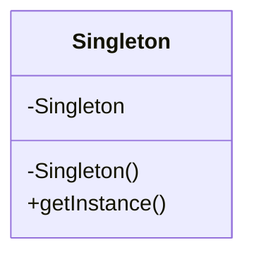

### 事例１
* サンプルケース

リソースの削減や多重アクセス防止のために、ただ1つのインスタンスとしてファイルマネージャを作成したい場合。

* サンプルコード

ファイルマネージャがシングルトンを継承することでサンプルケースを実装した。以下は、c++で実装したサンプルコードである。
```cpp
template<class T>
class Singleton
{
public:
    static inline T& GetInstance()
    {
        static T instance;
        return instance;
    }

protected:
    Singleton() {}
    virtual ~Singleton() {}

private:
    void operator=(const Singleton& obj) {}
    Singleton(const Singleton &obj) {}
};

class FileManager : public Singleton<FileManager>
{
public:
    friend class Singleton<FileManager>;

public:
    bool FileExists(const char* strName) const;
    File* OpenFile(const char* strName, eFileOpenMode mode);
    bool CloseFile(File* pFile);

protected:
    FileManager();
    virtual ~FileManager();
};

```


### 事例２
* サンプルケース

* サンプルコード

### その他（注意事項など，なんでも）
* インスタンスの状態を保持したり，クラス間で共通のメソッド，プロパティにアクセスしたい場合に用いる事が多い．
* 単純にコンストラクタとデストラクタをprivateにして、getInstanceでインスタンスを返すだけの場合、スレッドセーフでないという問題がある。
<br><br><br>
## *Adapterパターン
### 概要
* 既存のインターフェースを、クライアントが望むインターフェースと互換性を持たせるために変換するパターン。継承を用いる場合と委譲を用いる場合の2種類がある。

* 概略図

- 継承(is a 関係)を利用した方法
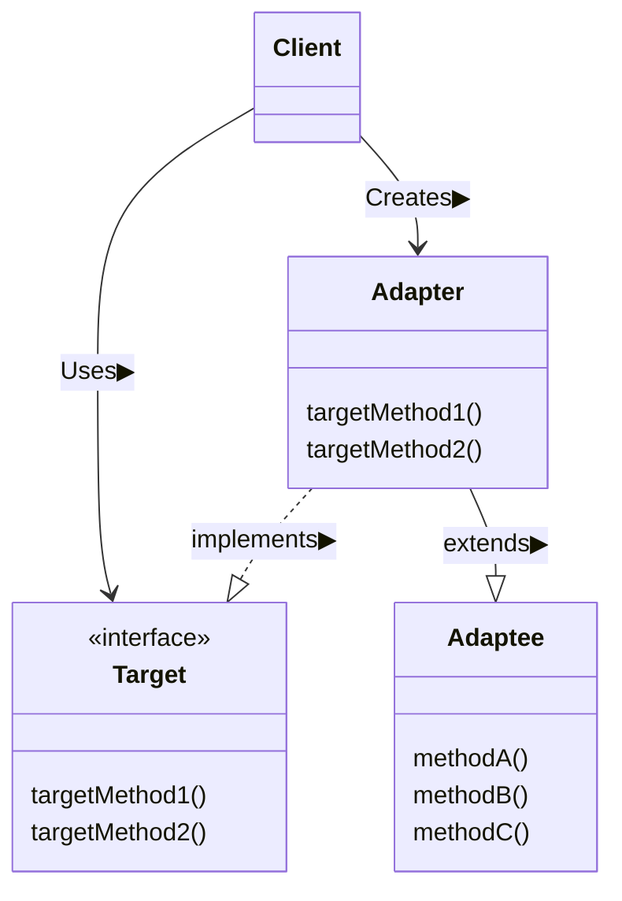

- 委譲(has a 関係)を利用した方法
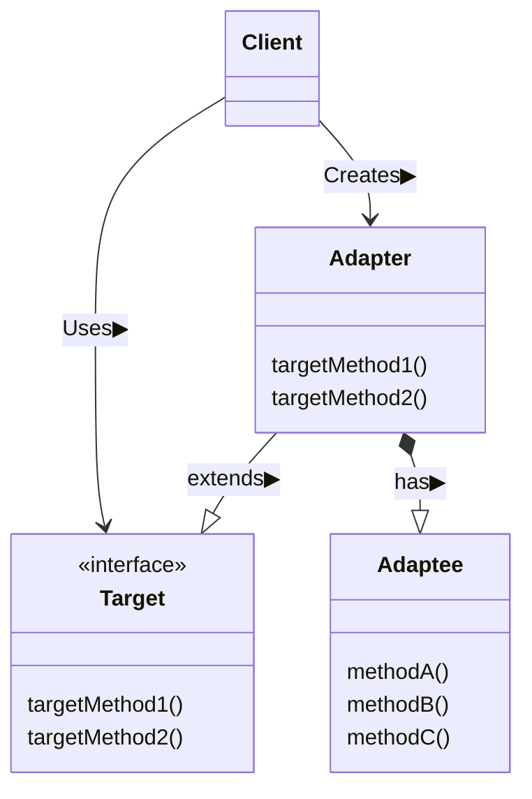

### 事例１
* サンプルケース
print

* サンプルコード

### 事例２
* サンプルケース

* サンプルコード

### その他（注意事項など，なんでも）


<br><br><br>
## *Facadeパターン*
### 概要
* 複雑な内部処理を隠蔽し，利用者にシンプルなインターフェースを提供する．

* 概略図

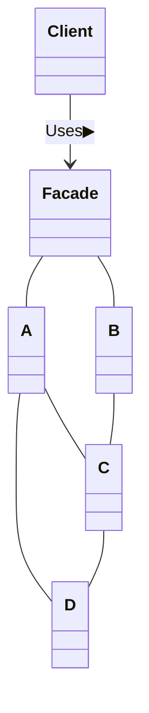

### 事例１
* サンプルケース

* サンプルコード

### 事例２
* サンプルケース

* サンプルコード

### その他（注意事項など，なんでも）


<br><br><br>
## *Template Methodパターン*
### 概要
* スーパークラスで処理手順の枠組みを決める．その手順で利用するメソッドを抽象メソッドで定義し，サブクラスで具体的な処理を実装する．

* 概略図
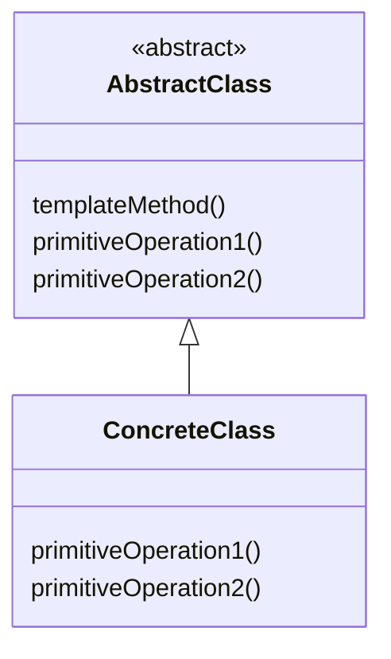

### 事例１
* サンプルケース

文字・文字列を5回繰り返し表示するケース。
さらに、単語は"*"で、文字列は枠線で囲って表示する。

* サンプルコード

このサンプルケースをPythonで実行する場合のサンプルコードをいかに示す。

・templatemethod/display.py
```python
#AbstractClass
from abc import ABCMeta, abstractmethod

class AbstractDisplay(metaclass=ABCMeta):
    @abstractmethod
    def print(self):
        pass

    @abstractmethod
    def open(self):
        pass

    @abstractmethod
    def close(self):
        pass

    def display(self):
        self.open()
        for _ in range(5):
            self.print()
        self.close()

#ConcreteClass        
class CharDisplay(AbstractDisplay):
    def __init__(self, ch):
        self.__ch = ch

    def open(self):
        print('*', end='')

    def print(self):
        print(self.__ch, end='')

    def close(self):
        print('*')

class StringDisplay(AbstractDisplay):
    def __init__(self, string):
        self.__string = string
        self.__width = len(string)

    def open(self):
        self.__printLine()

    def print(self):
        print("|{0}|".format(self.__string))

    def close(self):
        self.__printLine()

    def __printLine(self):
        print('+', end='')
        for _ in range(self.__width):
            print('-', end='')
        print('+')
```
・main.py
```python
from templatemethod.display import CharDisplay, StringDisplay

def startMain():
    c = CharDisplay('X')
    s = StringDisplay("Template Method")
    c.display()
    print("")
    s.display()

if __name__ == '__main__':
    startMain()
```
* 出力結果
```python
*XXXXX*

+---------------+
|Template Method|
|Template Method|
|Template Method|
|Template Method|
|Template Method|
+---------------+
```
### 事例２
* サンプルケース

* サンプルコード

### その他（注意事項など，なんでも）


<br><br><br>
## *Iteratorパターン*
### 概要
* 内部実装を公開せずに，コンテナオブジェクトの要素１つ１つに，順次アクセスする方法を提供する

* 概略図
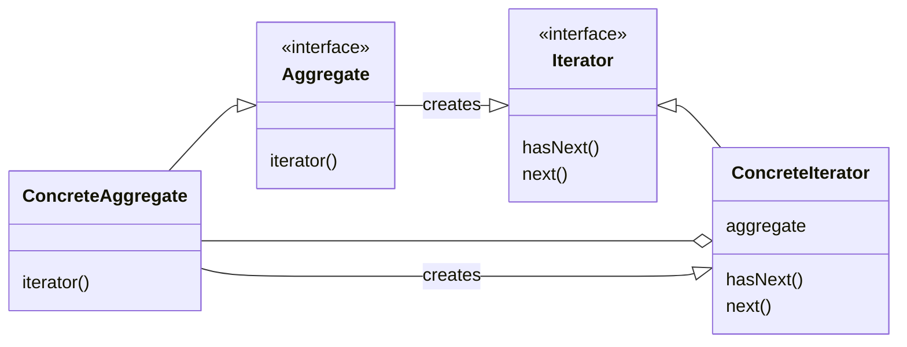
### 事例１
* サンプルケース

* サンプルコード

### 事例２
* サンプルケース

* サンプルコード

### その他（注意事項など，なんでも）


<br><br><br>
## *Compositeパターン*
### 概要
* オブジェクトの関係性に関するパターンである。ファイルシステムのような木構造を持つ再帰的なデータ構造に関して、全体像と個別のオブジェクトに同一の操作を可能にする。

* 概略図
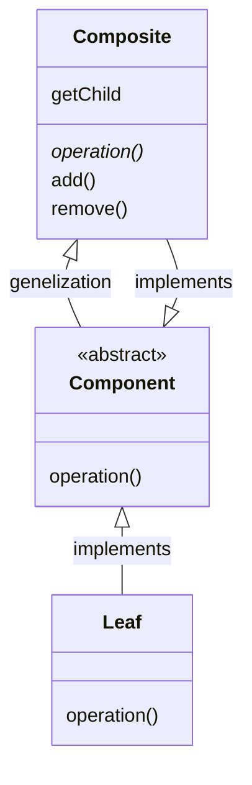
### 事例１
* サンプルケース

ファイルシステムにおいて、あるフォルダを削除するとそれ以下の内容物がまとめて削除される場合に、内容物の一つ一つがファイルとフォルダのどちらであるのかを意識せずに削除できるようにしたいケース。

* サンプルコード

### 事例２
* サンプルケース

* サンプルコード

### その他（注意事項など，なんでも）
