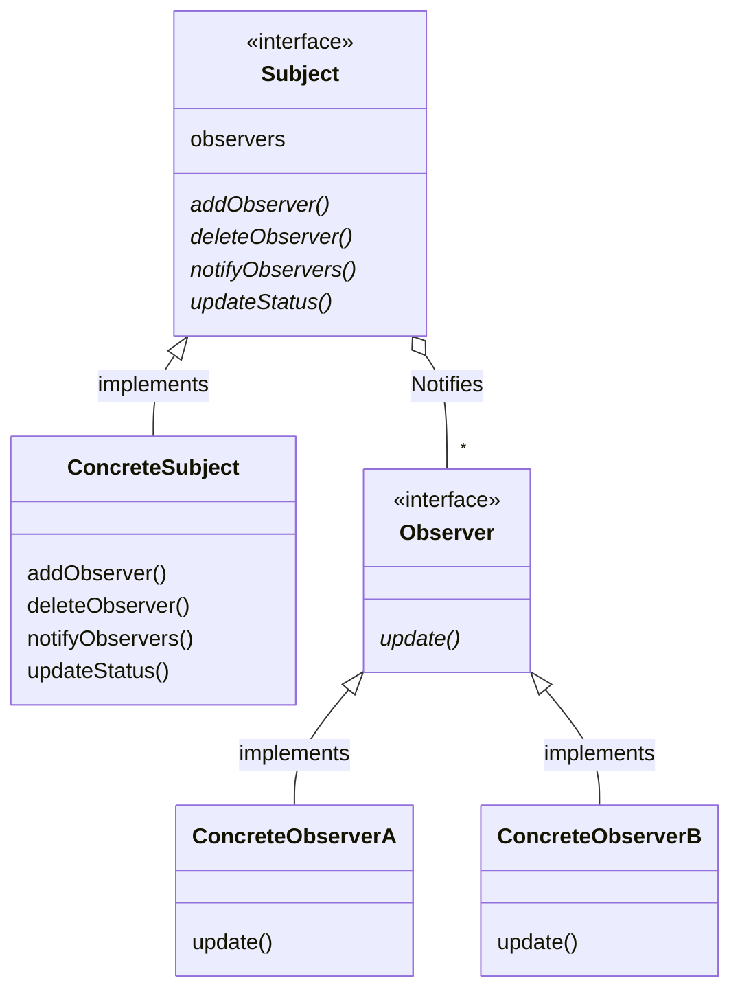
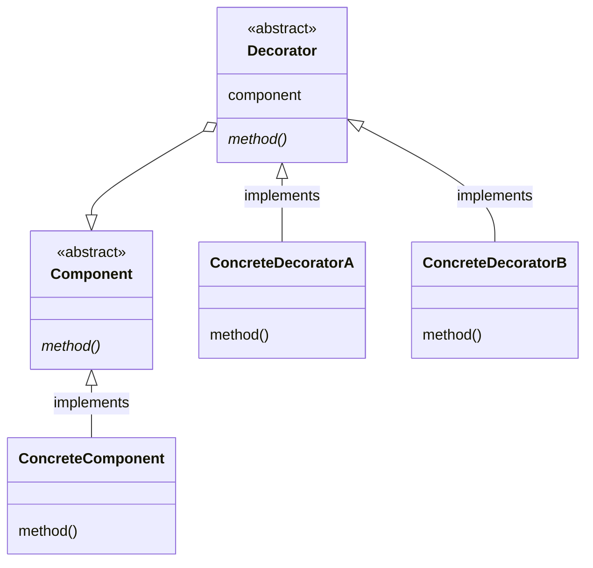

# 課題２：デザインパターンのまとめ

## *Observerパターン*
### ObserverクラスにSubjectクラスの変更の通知するパターン。
* 説明

* 概略図

### 事例１
* サンプルケース

* サンプルコード

### 事例２
* サンプルケース

* サンプルコード

### その他（注意事項など，なんでも）

   
## *Decoratorパターン*
### 概要
* 説明

* 概略図

### 事例１
* サンプルケース

* サンプルコード

### 事例２
* サンプルケース

* サンプルコード

### その他（注意事項など，なんでも）

   
## *Factory Methodパターン*
### 概要
* インスタンスの生成を行う専用のクラスを使う
＊複数のバリエーションを持つオブジェクトの生成をカプセル化する

* 概略図

### 事例１
* サンプルケース

* サンプルコード

### 事例２
* サンプルケース

* サンプルコード

### その他（注意事項など，なんでも）

   
## *Abstract Factoryパターン*
### 概要
* 説明

* 概略図

### 事例１
* サンプルケース

* サンプルコード

### 事例２
* サンプルケース

* サンプルコード

### その他（注意事項など，なんでも）

   
## *Singletonパターン*
### 概要
* 説明

* 概略図

### 事例１
* サンプルケース

* サンプルコード

### 事例２
* サンプルケース

* サンプルコード

### その他（注意事項など，なんでも）

   
## *Adapterパターン*
### 概要
* 既存のインターフェースを、クライアントが望むインターフェースと互換性を持たせるために変換するパターン。継承を用いる場合と委譲を用いる場合の2種類がある。

* 概略図

### 事例１
* サンプルケース

* サンプルコード

### 事例２
* サンプルケース

* サンプルコード

### その他（注意事項など，なんでも）

   
## *Facadeパターン*
### 概要
* 説明

* 概略図

### 事例１
* サンプルケース

* サンプルコード

### 事例２
* サンプルケース

* サンプルコード

### その他（注意事項など，なんでも）

   
## *Template Methodパターン*
### 概要
* 説明

* 概略図

### 事例１
* サンプルケース

* サンプルコード

### 事例２
* サンプルケース

* サンプルコード

### その他（注意事項など，なんでも）

   
## *Iteratorパターン*
### 概要
* 説明

* 概略図

### 事例１
* サンプルケース

* サンプルコード

### 事例２
* サンプルケース

* サンプルコード

### その他（注意事項など，なんでも）

   
## *Compositeパターン*
### 概要
* 説明

* 概略図

### 事例１
* サンプルケース

* サンプルコード

### 事例２
* サンプルケース

* サンプルコード

### その他（注意事項など，なんでも）

