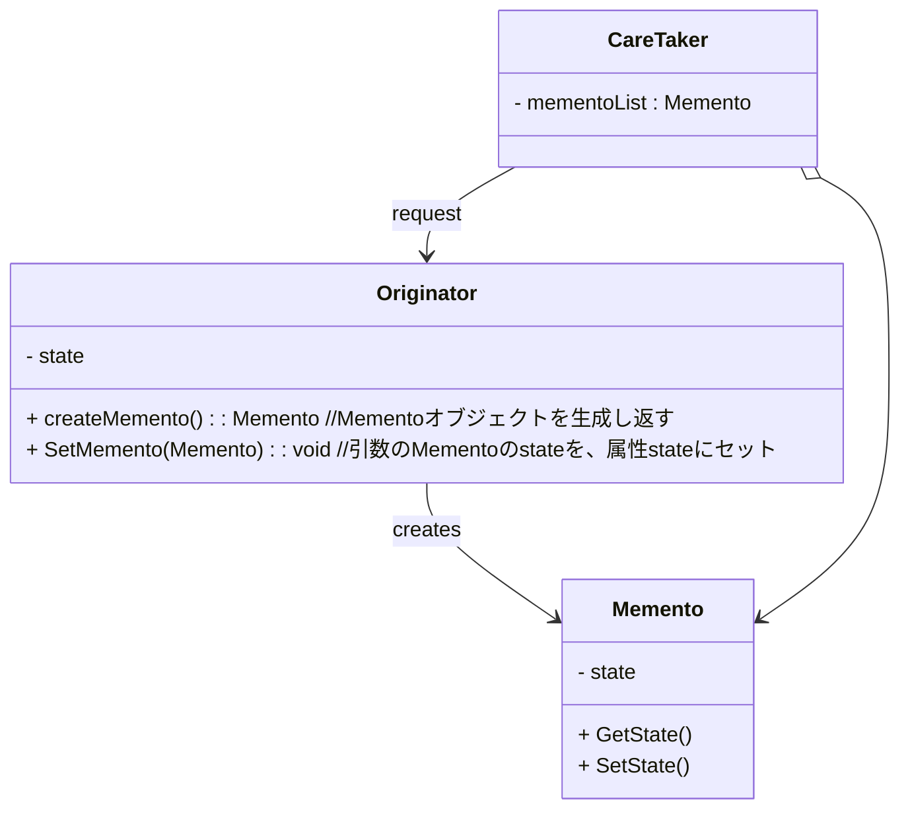

# Mementoパターン
あるオブジェクトの任意の時点の状態を記憶し，後でその状態にオブジェクトを戻すための工夫を提供するパターン．つまり，アンドゥを提供するパターン．

このパターンでは，状態を元に戻すための必要最小限の情報のみを保存する．

## 構成
### Originatorクラス
自分の状態をMementoとして保持したり，与えられたMementoから自身の状態を復元するクラス．

### Mementoクラス
Originatorの内部情報を保持するクラス．

### Caretakerクラス
Mementoを保持するクラス．Mementoを保持するタイミング，アンドゥするタイミングも保持する．

## クラス図

## 長所及び短所
### 長所
- 内部の実装や状態が不明でも，オブジェクトの状態のスナップショットを作成できる．
- CareTakerに状態の保持や復元操作を分離することで，Originatorのコードを簡素化できる．

### 短所
- Mementoの大量発生により，大量のメモリが必要となる．
- 不要なMementoの廃棄する場合，CareTakerはOriginatorのライフサイクルを把握する必要がある．
