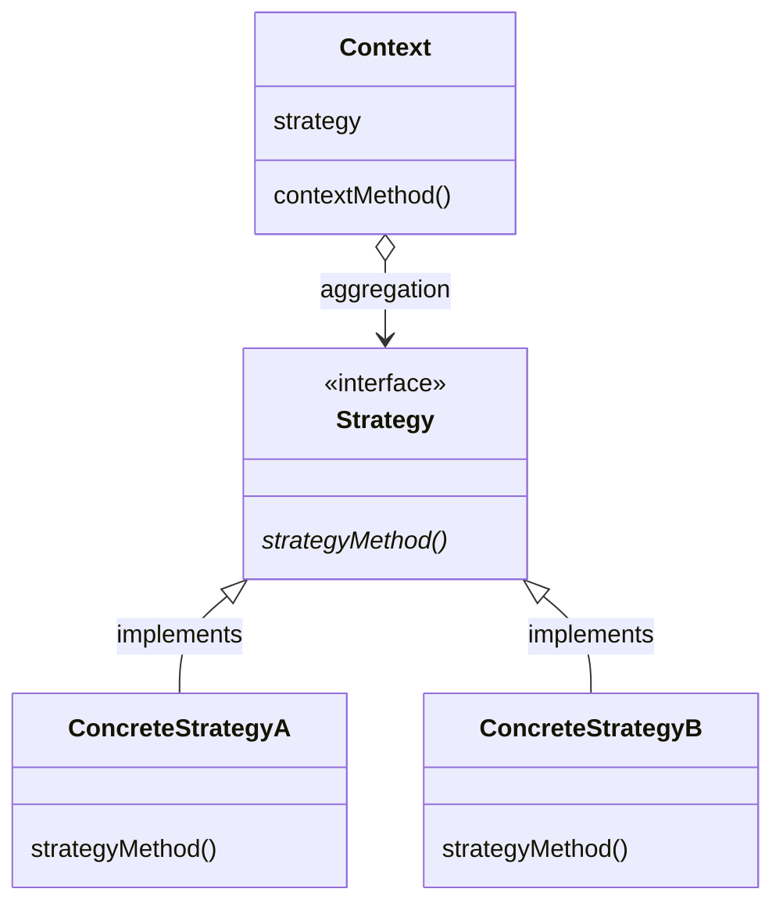

# 課題1：デザインパターン個別レポート
# Strategyパターン
## 概要
Strategyパターンは，プログラムの他の部分からアルゴリズムの部分を分離して実装することで，他の部分の実装の影響を与えずにアルゴリズム部分の実装のみを容易に丸ごと交換・編集できるように設計されたデザインパターンである．Strategyは「戦略」や「方策」といった意味である．

## Strategyパターンの恩恵
通常のプログラムでは，メソッド内に，他の処理と一緒に，アルゴリズムを記述していることが多いだろう．そして，if文やswitch文を用いてアルゴリズムを分岐させてしまいがちである．しかし，Strategyパターンでは，プログラムの他の部分からアルゴリズムを意図的に分離させている．これのおかげで，他の部分の処理を実装しているときはアルゴリズムの実装を気にする必要がなく，逆に，アルゴリズムを実装しているときは，他の部分の実装を気にすることなく，インターフェースを基にアルゴリズム本体を実装することだけに集中することができる．このようなアルゴリズムと他の部分の緩い結びつきによって，アルゴリズムを切り替えたり，インスタンスによってアルゴリズムを使い分けたり，アルゴリズムの改良・比較を行うことが容易にできる．これはオブジェクト指向プログラミングのカプセル化や多態性（ポリモーフィズム）を用いているともいえる．

## クラス図
Strategyパターンにおけるクラス図の概略を以下に示す．Strategyパターンでは大きく3種類のクラス・インターフェースを用いる．
### Strategyインターフェース
アルゴリズムの大まかな定義を記述する．このインターフェース(API)を元に具体的なアルゴリズムを実装する．
### ConcreteStrategyクラス
Strategyインターフェースを継承し，アルゴリズムの具体的な流れを実装する．
### Contextクラス
アルゴリズムを利用するクラス．ConcreteStrategyのインスタンスを持ち，必要に応じてそれを利用する．ただ，コード上で呼び出すのはStrategyのインスタンスである．


## サンプルプログラム(Java)
Strategyパターンに関して本質的でないクラスやコードは省略する．メソッドの引数・返り値の型は仮にvoid型とする．
### Strategyインターフェース

```Java
public interface Strategy {
    public abstract void strategyMethod();
}
```

### ConcreteStrategyAクラス

```Java
public class ConcreteStrategyA implements Strategy {
    @Override
    public void strategyMethod() {
        // 略
    }
}
```

### ConcreteStrategyBクラス

```Java
public class ConcreteStrategyB implements Strategy {
    @Override
    public void strategyMethod() {
        // 略
    }
}
```

### Contextクラス

```Java
public class Context {
    private Strategy strategy;

    // コンストラクタ
    public Context(Strategy strategy) {
        this.strategy = strategy;
    }
}
```

## サンプルプログラム(C++)
Strategyパターンに関して本質的でないクラスやコードは省略する．メソッドの引数・返り値の型は仮にvoid型とする．
### Strategyインターフェース

```C++
class Strategy {
    public:
        virtual void strategyMethod(void) = 0;
        virtual ~strategyMethod() {}; // デストラクタ
}
```

### ConcreteStrategyAクラス

```C++
class ConcreteStrategyA : public Strategy {
    public:
        // オーバーライド
        void strategyMethod(void) {
            // 略
        }
}
```

### ConcreteStrategyBクラス

```C++
class ConcreteStrategyB : public Strategy {
    public:
        // オーバーライド
        void strategyMethod(void) {
            // 略
        }
}
```

### Contextクラス

```C++
class Context {
    private:
        Strategy strategy;

    public:
        // コンストラクタ
        Context(Strategy strategy) {
            this.strategy = strategy;
        }
}
```

## 参考文献
[1] 結城 浩. *Java言語で学ぶデザインパターン入門 第3版*. SBクリエイティブ, 2021.