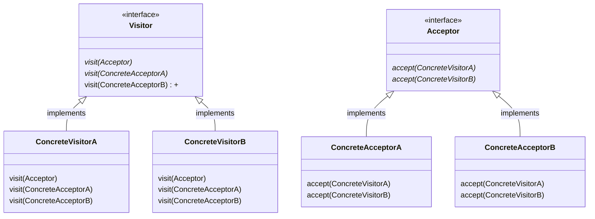

# 課題１:デザインパターン個別レポート
## Visitor パターン

Visitorパターンでは,任意の処理を訪問者であるVIsitorオブジェクトに追加することで,処理の追加を単純化する.
すなわち,Visitorに処理を一任しているため,受け入れる側にはVisitorに合わせた処理を追加する必要がないパターンである.

## Visitorパターンのクラス図
visitorパターンにおけるクラス図の概略を以下に示す.
Visitorパターンでは大きく4種類のクラス及びインターフェースに分類されている.

1. Visitor(インターフェース)
具体的なデータ構造の要素それぞれに対して,訪問し行う処理(visitメソッド)のインターフェースを定義する.
2. ConcreteVisitor(クラス)
1のVisitorで定義したインターフェース(各visitメソッド)を実装する.
この時のVisitメソッドは,Acceptorを引数にしている.
3. Acceptor(インターフェース)
Visitorの訪問先であるデータ構造要素に対して,受け入れ窓口(acceptメソッド)のインターフェースを定義する.
4. ConcreteAcceptor(クラス)
Acceptorで定義したインターフェース(acceptメソッド)を実装する.
ここでは,引数VisitorのVisitメソッドを実行するような実装をしている.




# 事例１
- サンプルケース

- サンプルコード - python

```python
from abc import ABCMeta, abstractmethod

# 訪問者クラス
class Visitor(metaclass=ABCMeta):
    @abstractmethod
    def visit(self, company):
        pass

    @abstractmethod
    def visit(self, depart):
        pass

# 訪問先クラス
class Acceptor(metaclass=ABCMeta):
    @abstractmethod
    def accept(self, visitor):
        pass

# 会社クラス
class Company(Acceptor):
    def __init__(self):
        self.__name = "Company"

    def getName(self) -> str:
        return self.__name

    def accept(self, visitor) -> None:
        visitor.visit(self)

# デパートクラス
class Depart(Acceptor):
    def __init__(self):
        self.__name = "Depart"

    def getName(self) -> str:
        return self.__name

    def accept(self, visitor) -> None:
        visitor.visit(self)

# 訪問者Aクラス
class VisitorA(Visitor):
    def __init__(self):
        self.__name = "Aさん"

    def visit(self, company: Company) -> None:
        print(self.__name, "が", company.getName(), "を訪れました。")

    def visit(self, depart: Depart) -> None:
        print(self.__name, "が", depart.getName(), "を訪れました。")

# 訪問者Bクラス
class VisitorB(Visitor):
    def __init__(self):
        self.__name = "Bさん"

    def visit(self, company: Company) -> None:
        print(self.__name, "が", company.getName(), "を訪れました。")

    def visit(self, depart: Depart) -> None:
        print(self.__name, "が", depart.getName(), "を訪れました。")

if __name__ == "__main__":
    Company().accept(VisitorA())
    Company().accept(VisitorB())
    Depart().accept(VisitorA())
    Depart().accept(VisitorB())
    print("")
    VisitorA().visit(Company())
    VisitorA().visit(Depart())
    VisitorB().visit(Company())
    VisitorB().visit(Depart())
 ```

 - 出力
```python
(base) kumagai@kumagairuinoMacBook-Air SELecture2022_GitReport % python test.py
Aさん が Company を訪れました。
Bさん が Company を訪れました。
Aさん が Depart を訪れました。
Bさん が Depart を訪れました。

Aさん が Company を訪れました。
Aさん が Depart を訪れました。
Bさん が Company を訪れました。
Bさん が Depart を訪れました。
```