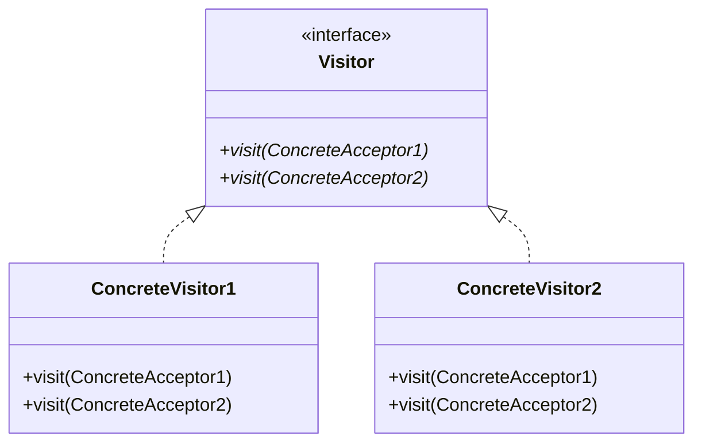
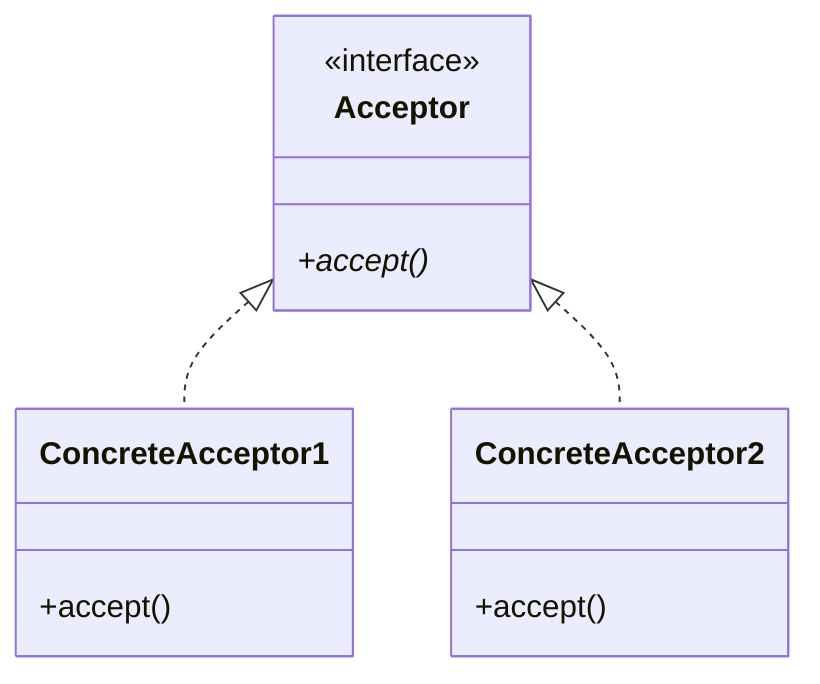

# Visitorパターン

振る舞いに関するパターンの一つである。「データ構造」と「データに対する処理」を別々のクラスで実装する。メリットとして、データ構造を変更することなく新しい処理を追加でき、機能の拡張が容易となる。

## 構成
-Visitorクラス:データに対する処理を記述するクラス。メソッド*visit*で実際の処理を実装する。インターフェースを作成し、処理ごとにメソッド*visit*をオーバーロードする。

-Acceptorクラス:データを保持するクラス。メソッド*accept*でVisitorクラスのvisitを呼び出し、データ構造に対して何らかの処理を行う。

## 大まかな流れ
1.Acceptorへ利用対象としたいデータを渡す。（既に渡している場合はこの手順は必要ない。）
1.Acceptorクラスのメソッドacceptを呼び出す。この際、引数などにより用いるVisitor（インターフェースは不可）を指定する。
1.acceptメソッドにより呼び出されたVisitorクラスが、visit関数を作動させてデータに対してなんらかの処理を行う。

## Visitorパターンの利用先
ある大規模データから、いくつかの測定結果を求めたいときに有用であると考える。大規模データと処理プログラムを別々に置くことで、データ処理変更の際にデータ保存領域を触る必要が無くなる。ゆえに、アップデートの際の負荷低減を実現できると考える。

# 参考文献
-"Visitor パターン ( データ構造を表すクラスと, それに対する処理を行うクラスを分離する. (データ構造を表すクラスを変更することなしに処理を追加できる) )". WTOPIA v1.0 documentation. https://ie.u-ryukyu.ac.jp/~e085739/java.it.23.html
-@y518gaku. "Visitorパターンについて". Qiita. 2020/03/25. https://qiita.com/y518gaku/items/ca1d5433e2c08da877a4
