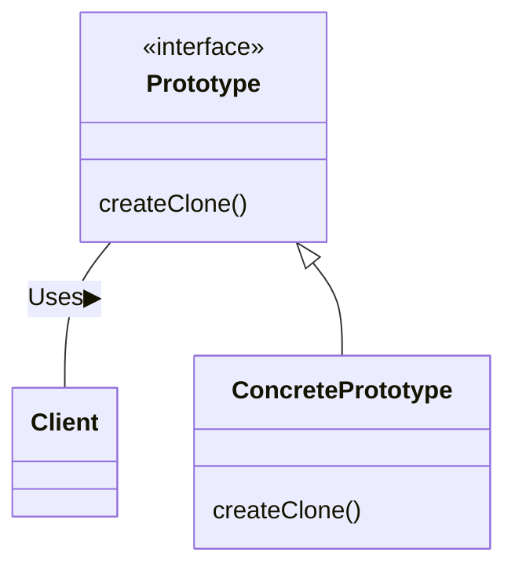

# 課題１:
##  Prototypeパターン

### 概要
* インスタンスを実装する時のデザインパターン。クラスからインスタンスを生成するのではなく、インスタンスから別のインスタンスをコピーして生成する。

* 概略図

### 事例
* サンプルケース

同じ文字列に対して異なる装飾を施して表示させるケース。
ここでは、次のような動作を確認する。

・文字列を、下線を引いて表示する

・文字列を、枠線で囲って表示する

* サンプルコード

このサンプルケースをPythonで実行する場合のサンプルコードを以下に示す。

・prototype/prototype.py
```python
from abc import ABCMeta, abstractmethod

class Prototype(metaclass=ABCMeta):
    @abstractmethod
    def use(self, s):
        pass

    @abstractmethod
    def createClone(self):
        pass
```
・prototype/concreteprototype/underline_pen_prototype.py
```python
import copy
from prototype.prototype import Prototype

class UnderlinePen(Prototype):
    def __init__(self, ulchar):
        self.__ulchar = ulchar

    def use(self, s):
        length = len(s)
        line = self.__ulchar * (length + 2)

        print("\"{0}\"".format(s))
        print("{0}\n".format(line))

    def createClone(self):
        clone = copy.deepcopy(self)
        return clone
```
・prototype/concreteprototype/message_box_prototype.py
```python
import copy
from prototype.prototype import Prototype

class MessageBox(Prototype):
    def __init__(self, decochar):
        self.__decochar = decochar

    def use(self, s):
        length = len(s)
        line = self.__decochar * (length + 4)

        print("{0}".format(line))
        print("{0} {1} {2}".format(self.__decochar, s, self.__decochar))
        print("{0}\n".format(line))

    def createClone(self):
        clone = copy.deepcopy(self)
        return clone
```
・prototype/manager.py
```python
class Manager(object):
    def __init__(self):
        self.__showcase = {}

    def register(self, name, proto):
        self.__showcase[name] = proto

    def create(self, protoname):
        p = self.__showcase[protoname]
        return p.createClone()
```
・main.py
```python
from prototype.manager import Manager
from prototype.concreteprototype.underline_pen_prototype import UnderlinePen
from prototype.concreteprototype.message_box_prototype import MessageBox

def startMain(managerObject):
    upen = UnderlinePen("-")
    box = MessageBox("+")

    managerObject.register("strong message", upen)
    managerObject.register("warning box", box)

    l = managerObject.create("strong message")
    b = managerObject.create("warning box")

    l.use("Prototype")
    b.use("Prototype")

if __name__ == "__main__":
    startMain(Manager())
```
・出力結果
```python
"Prototype"
-----------

+++++++++++++
+ Prototype +
+++++++++++++
```
